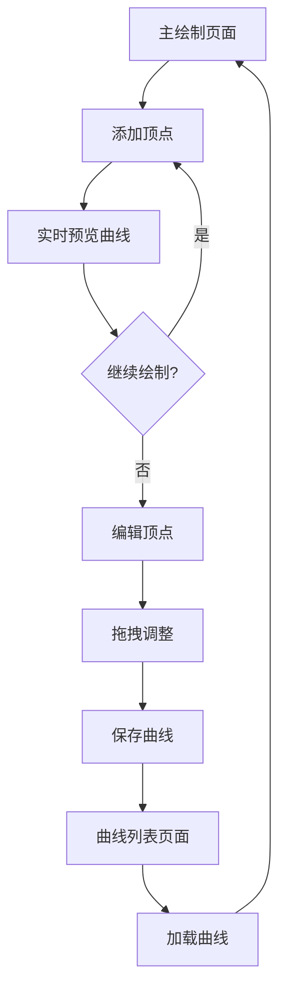

## 1. 产品概述
交互式曲线绘制软件是一款基于Web的图形绘制工具，用户可以通过鼠标交互方式在画布上绘制平滑曲线。该产品主要解决传统绘图软件依赖第三方库的问题，通过底层算法实现曲线插值和渲染，为教育、设计和工程领域提供轻量级的曲线绘制解决方案。

目标用户包括图形设计师、教育工作者、工程制图人员等需要精确绘制曲线的专业人士。

## 2. 核心功能

### 2.1 用户角色
| 角色 | 注册方式 | 核心权限 |
|------|----------|----------|
| 普通用户 | 无需注册 | 绘制曲线、编辑顶点、保存/加载曲线数据 |
| 高级用户 | 可选注册 | 额外获得云端存储、曲线分享等高级功能 |

### 2.2 功能模块
本曲线绘制软件包含以下核心页面：
1. **主绘制页面**：画布区域、工具栏、顶点管理面板
2. **曲线列表页面**：已保存曲线的浏览、加载、删除
3. **设置页面**：画布参数配置、导出选项

### 2.3 页面详情
| 页面名称 | 模块名称 | 功能描述 |
|----------|----------|----------|
| 主绘制页面 | 画布区域 | 支持鼠标点击添加顶点，实时预览曲线走向，拖拽顶点编辑曲线形状 |
| 主绘制页面 | 工具栏 | 提供绘制模式切换、顶点显示/隐藏、曲线样式设置等功能 |
| 主绘制页面 | 顶点管理 | 显示顶点列表，支持选择、删除、添加新顶点 |
| 曲线列表页面 | 曲线浏览 | 以缩略图形式展示所有保存的曲线，支持预览 |
| 曲线列表页面 | 曲线操作 | 加载选中曲线到编辑区，删除不需要的曲线 |
| 设置页面 | 画布设置 | 调整画布大小、背景色、网格显示等参数 |
| 设置页面 | 导出选项 | 支持将曲线导出为JSON数据或图片格式 |

## 3. 核心流程
用户操作流程：
1. 进入主绘制页面，系统自动创建空白画布
2. 用户通过鼠标点击在画布上添加顶点，系统自动计算并绘制平滑曲线
3. 绘制过程中鼠标移动时显示实时预览效果
4. 完成绘制后可点击顶点进行拖拽编辑，或添加/删除顶点
5. 可将绘制完成的曲线保存到本地或云端
6. 在曲线列表页面可浏览、加载已保存的曲线继续编辑

## 4. 用户界面设计

### 4.1 设计风格
- **主色调**：深蓝色(#1E3A8A)作为主色，白色(#FFFFFF)作为背景色，橙色(#F97316)作为强调色
- **按钮样式**：圆角矩形设计，hover状态有轻微阴影效果
- **字体选择**：主标题使用24px微软雅黑，正文使用16px苹方字体
- **布局风格**：左侧工具栏+中央画布+右侧属性面板的经典设计布局
- **图标风格**：使用简洁的线性图标，符合现代UI设计趋势

### 4.2 页面设计概述
| 页面名称 | 模块名称 | UI元素 |
|----------|----------|--------|
| 主绘制页面 | 画布区域 | 800×600像素主画布，白色背景，可选网格显示，顶点用红色圆点(6px半径)标记 |
| 主绘制页面 | 工具栏 | 垂直布局在左侧，包含绘制工具图标，每个工具32×32像素，间距8px |
| 主绘制页面 | 顶点管理 | 右侧面板，显示顶点坐标列表，支持点击选中，选中状态高亮显示 |
| 曲线列表页面 | 曲线网格 | 4列网格布局，每个曲线项包含缩略图(150×100px)和名称 |
| 设置页面 | 参数表单 | 分组显示画布参数、导出选项，使用标准表单控件 |

### 4.3 响应式设计
采用桌面端优先的设计策略，主画布区域最小宽度800px，在较小屏幕上会出现横向滚动条。工具栏和属性面板在大屏幕上固定宽度，小屏幕上可折叠隐藏。

### 4.4 交互细节
- 顶点hover状态：红色圆点变为橙色，显示坐标tooltip
- 曲线选中状态：线条宽度从2px增加到3px，颜色加深
- 拖拽顶点时：显示辅助线和实时坐标更新
- 操作反馈：所有用户操作都有视觉反馈，如按钮点击效果、操作成功提示等