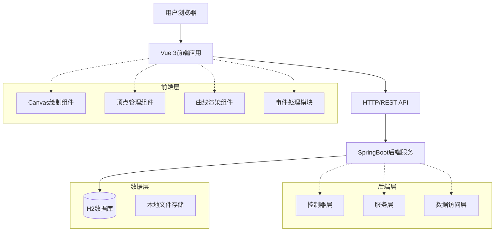
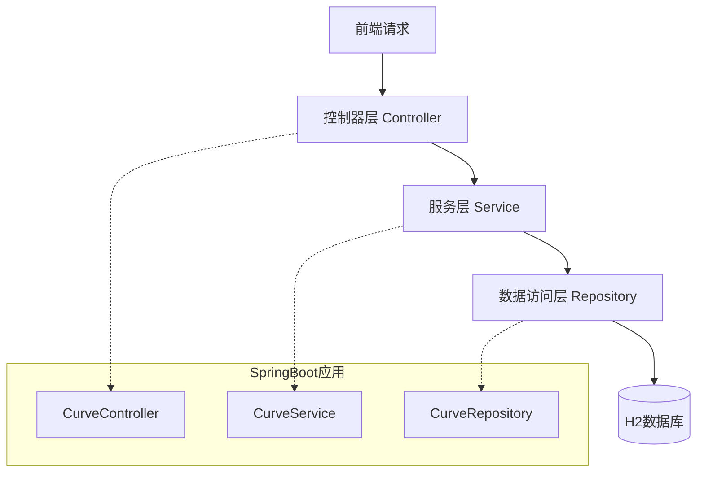
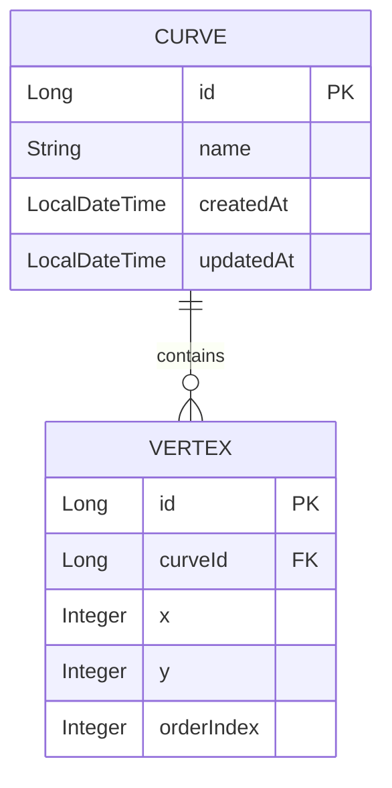

## 1. 架构设计



## 2. 技术描述

- **前端**: Vue 3 + TypeScript + Vite + 原生Canvas API
- **初始化工具**: Vite (create-vite)
- **后端**: Java 17 + SpringBoot 3.x + Spring Web + Spring Data JPA
- **数据库**: H2内存数据库 (开发环境) / MySQL (生产环境)
- **构建工具**: Maven (后端) + npm/yarn (前端)

## 3. 路由定义

| 路由 | 用途 |
|------|------|
| / | 主绘制页面，提供画布和绘图工具 |
| /curves | 曲线列表页面，展示保存的曲线 |
| /settings | 设置页面，配置画布参数 |
| /api/curves | 曲线数据API，支持CRUD操作 |
| /api/curves/{id} | 单条曲线数据的获取、更新、删除 |

## 4. API定义

### 4.1 曲线数据API

**获取所有曲线**
```
GET /api/curves
```

响应参数：
| 参数名 | 参数类型 | 描述 |
|--------|----------|------|
| id | Long | 曲线唯一标识 |
| name | String | 曲线名称 |
| vertices | Array | 顶点坐标数组 |
| createdAt | Date | 创建时间 |
| updatedAt | Date | 更新时间 |

**保存新曲线**
```
POST /api/curves
```

请求体：
```json
{
  "name": "示例曲线",
  "vertices": [
    {"x": 100, "y": 200},
    {"x": 200, "y": 150},
    {"x": 300, "y": 250}
  ]
}
```

**更新曲线**
```
PUT /api/curves/{id}
```

**删除曲线**
```
DELETE /api/curves/{id}
```

## 5. 服务器架构图



## 6. 数据模型

### 6.1 数据模型定义



### 6.2 数据定义语言

**曲线表 (curves)**
```sql
CREATE TABLE curves (
    id BIGINT AUTO_INCREMENT PRIMARY KEY,
    name VARCHAR(255) NOT NULL,
    created_at TIMESTAMP DEFAULT CURRENT_TIMESTAMP,
    updated_at TIMESTAMP DEFAULT CURRENT_TIMESTAMP ON UPDATE CURRENT_TIMESTAMP
);

CREATE INDEX idx_curves_created_at ON curves(created_at DESC);
```

**顶点表 (vertices)**
```sql
CREATE TABLE vertices (
    id BIGINT AUTO_INCREMENT PRIMARY KEY,
    curve_id BIGINT NOT NULL,
    x INTEGER NOT NULL,
    y INTEGER NOT NULL,
    order_index INTEGER NOT NULL,
    FOREIGN KEY (curve_id) REFERENCES curves(id) ON DELETE CASCADE,
    INDEX idx_vertices_curve_id (curve_id),
    INDEX idx_vertices_order (curve_id, order_index)
);
```

## 7. 前端技术实现细节

### 7.1 Canvas绘制核心算法
- **贝塞尔曲线计算**: 使用De Casteljau算法实现三次贝塞尔曲线
- **顶点插值**: 基于Catmull-Rom样条曲线实现平滑连接
- **碰撞检测**: 实现顶点选中的圆形碰撞检测算法
- **坐标转换**: 处理屏幕坐标与Canvas坐标的相互转换

### 7.2 组件架构
```
src/
├── components/
│   ├── CanvasDrawer.vue      # 主画布组件
│   ├── VertexManager.vue     # 顶点管理面板
│   ├── CurveRenderer.vue     # 曲线渲染组件
│   └── Toolbar.vue          # 工具栏组件
├── utils/
│   ├── bezier.js            # 贝塞尔曲线算法
│   ├── interpolation.js     # 插值算法
│   └── geometry.js          # 几何计算工具
├── stores/
│   └── curveStore.js        # 状态管理
└── api/
    └── curveApi.js          # 后端API接口
```

## 8. 后端技术实现细节

### 8.1 项目结构
```
src/main/java/com/curvedrawing/
├── controller/
│   └── CurveController.java    # RESTful接口
├── service/
│   ├── CurveService.java       # 业务逻辑接口
│   └── impl/
│       └── CurveServiceImpl.java # 业务逻辑实现
├── repository/
│   ├── CurveRepository.java    # 曲线数据访问
│   └── VertexRepository.java   # 顶点数据访问
├── entity/
│   ├── Curve.java             # 曲线实体
│   └── Vertex.java            # 顶点实体
└── dto/
    ├── CurveDTO.java          # 数据传输对象
    └── VertexDTO.java         # 顶点数据传输对象
```

### 8.2 核心服务接口
- **曲线管理服务**: 提供曲线的增删改查功能
- **顶点管理服务**: 处理顶点数据的持久化
- **数据验证服务**: 确保曲线数据的完整性和有效性
- **异常处理**: 统一的异常处理和错误响应机制