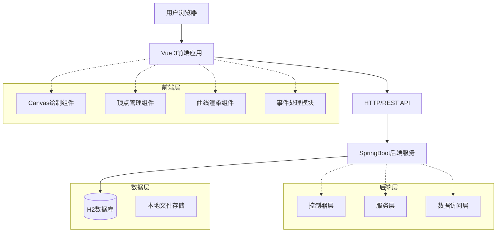
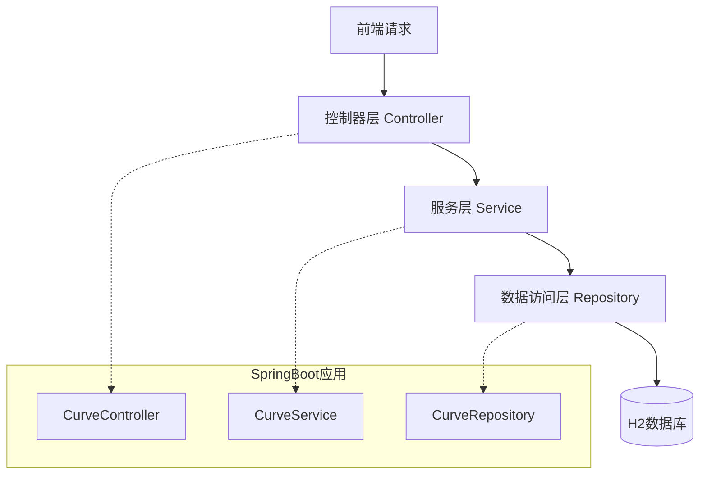
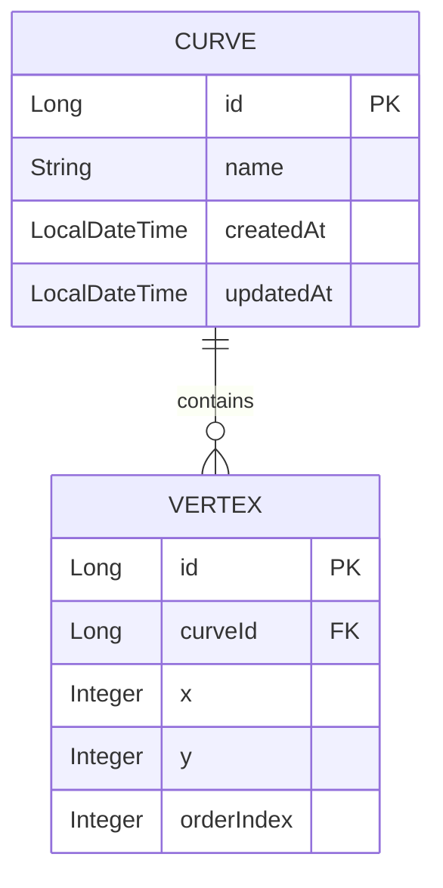
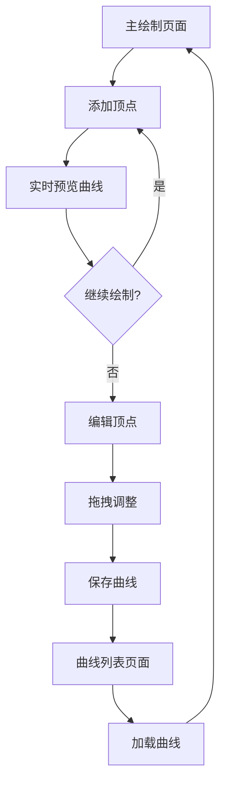

# 交互式曲线绘制软件 - 完整代码解释文档

## 1. 项目概述

### 1.1 产品定位

交互式曲线绘制软件是一款基于 Web 的图形绘制工具，用户可以通过鼠标交互方式在画布上绘制平滑曲线。该产品主要解决传统绘图软件依赖第三方库的问题，通过底层算法实现曲线插值和渲染，为教育、设计和工程领域提供轻量级的曲线绘制解决方案。

### 1.2 目标用户

包括图形设计师、教育工作者、工程制图人员等需要精确绘制曲线的专业人士。

### 1.3 用户角色与权限

| 角色   | 注册方式 | 核心权限                  |
| ---- | ---- | --------------------- |
| 普通用户 | 无需注册 | 绘制曲线、编辑顶点、保存 / 加载曲线数据 |
| 高级用户 | 可选注册 | 额外获得云端存储、曲线分享等高级功能    |

## 2. 架构设计

### 2.1 整体架构



### 2.2 服务器架构



### 2.3 技术栈选型

| 层级    | 技术选型                                                    |
| ----- | ------------------------------------------------------- |
| 前端    | Vue 3 + TypeScript + Vite + 原生 Canvas API               |
| 初始化工具 | Vite (create-vite)                                      |
| 后端    | Java 17 + SpringBoot 3.x + Spring Web + Spring Data JPA |
| 数据库   | H2 内存数据库 (开发环境) / MySQL (生产环境)                          |
| 构建工具  | Maven (后端) + npm/yarn (前端)                              |

### 2.4 路由定义

| 路由               | 用途                  |
| ---------------- | ------------------- |
| /                | 主绘制页面，提供画布和绘图工具     |
| /curves          | 曲线列表页面，展示保存的曲线      |
| /settings        | 设置页面，配置画布参数         |
| /api/curves      | 曲线数据 API，支持 CRUD 操作 |
| /api/curves/{id} | 单条曲线数据的获取、更新、删除     |

### 2.5 API 定义

#### 2.5.1 曲线数据 API

**获取所有曲线**

```Plain
GET /api/curves
```

响应参数：

| 参数名       | 参数类型   | 描述     |
| --------- | ------ | ------ |
| id        | Long   | 曲线唯一标识 |
| name      | String | 曲线名称   |
| vertices  | Array  | 顶点坐标数组 |
| createdAt | Date   | 创建时间   |
| updatedAt | Date   | 更新时间   |

**保存新曲线**

```Plain
POST /api/curves
```

请求体：

```json
{
  "name": "示例曲线",
  "vertices": [
    {"x": 100, "y": 200},
    {"x": 200, "y": 150},
    {"x": 300, "y": 250}
  ]
}
```

**更新曲线**

```Plain
PUT /api/curves/{id}
```

**删除曲线**

```Plain
DELETE /api/curves/{id}
```

### 2.6 数据模型

#### 2.6.1 实体关系



#### 2.6.2 数据定义语言

**曲线表 (curves)**

```sql
CREATE TABLE curves (
    id BIGINT AUTO_INCREMENT PRIMARY KEY,
    name VARCHAR(255) NOT NULL,
    created_at TIMESTAMP DEFAULT CURRENT_TIMESTAMP,
    updated_at TIMESTAMP DEFAULT CURRENT_TIMESTAMP ON UPDATE CURRENT_TIMESTAMP
);

CREATE INDEX idx_curves_created_at ON curves(created_at DESC);
```

**顶点表 (vertices)**

```sql
CREATE TABLE vertices (
    id BIGINT AUTO_INCREMENT PRIMARY KEY,
    curve_id BIGINT NOT NULL,
    x INTEGER NOT NULL,
    y INTEGER NOT NULL,
    order_index INTEGER NOT NULL,
    FOREIGN KEY (curve_id) REFERENCES curves(id) ON DELETE CASCADE,
    INDEX idx_vertices_curve_id (curve_id),
    INDEX idx_vertices_order (curve_id, order_index)
);
```

## 3. 核心功能与 UI 设计

### 3.1 核心功能模块

| 页面名称   | 模块名称 | 功能描述                           |
| ------ | ---- | ------------------------------ |
| 主绘制页面  | 画布区域 | 支持鼠标点击添加顶点，实时预览曲线走向，拖拽顶点编辑曲线形状 |
| 主绘制页面  | 工具栏  | 提供绘制模式切换、顶点显示 / 隐藏、曲线样式设置等功能   |
| 主绘制页面  | 顶点管理 | 显示顶点列表，支持选择、删除、添加新顶点           |
| 曲线列表页面 | 曲线浏览 | 以缩略图形式展示所有保存的曲线，支持预览           |
| 曲线列表页面 | 曲线操作 | 加载选中曲线到编辑区，删除不需要的曲线            |
| 设置页面   | 画布设置 | 调整画布大小、背景色、网格显示等参数             |
| 设置页面   | 导出选项 | 支持将曲线导出为 JSON 数据或图片格式          |

### 3.2 用户操作流程



### 3.3 UI 设计规范

#### 3.3.1 设计风格

- **主色调**：深蓝色 (#1E3A8A) 作为主色，白色 (#FFFFFF) 作为背景色，橙色 (#F97316) 作为强调色
- **按钮样式**：圆角矩形设计，hover 状态有轻微阴影效果
- **字体选择**：主标题使用 24px 微软雅黑，正文使用 16px 苹方字体
- **布局风格**：左侧工具栏 + 中央画布 + 右侧属性面板的经典设计布局
- **图标风格**：使用简洁的线性图标，符合现代 UI 设计趋势

#### 3.3.2 页面 UI 元素

| 页面名称   | 模块名称 | UI 元素                                         |
| ------ | ---- | --------------------------------------------- |
| 主绘制页面  | 画布区域 | 800×600 像素主画布，白色背景，可选网格显示，顶点用红色圆点 (6px 半径) 标记 |
| 主绘制页面  | 工具栏  | 垂直布局在左侧，包含绘制工具图标，每个工具 32×32 像素，间距 8px         |
| 主绘制页面  | 顶点管理 | 右侧面板，显示顶点坐标列表，支持点击选中，选中状态高亮显示                 |
| 曲线列表页面 | 曲线网格 | 4 列网格布局，每个曲线项包含缩略图 (150×100px) 和名称            |
| 设置页面   | 参数表单 | 分组显示画布参数、导出选项，使用标准表单控件                        |

#### 3.3.3 响应式设计

采用桌面端优先的设计策略，主画布区域最小宽度 800px，在较小屏幕上会出现横向滚动条。工具栏和属性面板在大屏幕上固定宽度，小屏幕上可折叠隐藏。

#### 3.3.4 交互细节

- 顶点 hover 状态：红色圆点变为橙色，显示坐标 tooltip
- 曲线选中状态：线条宽度从 2px 增加到 3px，颜色加深
- 拖拽顶点时：显示辅助线和实时坐标更新
- 操作反馈：所有用户操作都有视觉反馈，如按钮点击效果、操作成功提示等

## 4. 核心代码解释

### 4.1 项目结构

#### 4.1.1 前端结构

```Plain
src/
├── components/
│   ├── CanvasDrawer.vue      # 主画布组件
│   ├── VertexManager.vue     # 顶点管理面板
│   ├── CurveRenderer.vue     # 曲线渲染组件
│   └── Toolbar.vue          # 工具栏组件
├── utils/
│   ├── bezier.js            # 贝塞尔曲线算法
│   ├── interpolation.js     # 插值算法
│   └── geometry.js          # 几何计算工具
├── stores/
│   └── curveStore.js        # 状态管理
└── api/
    └── curveApi.js          # 后端API接口
```

#### 4.1.2 后端结构

```Plain
src/main/java/com/curvedrawing/
├── controller/
│   └── CurveController.java    # RESTful接口
├── service/
│   ├── CurveService.java       # 业务逻辑接口
│   └── impl/
│       └── CurveServiceImpl.java # 业务逻辑实现
├── repository/
│   ├── CurveRepository.java    # 曲线数据访问
│   └── VertexRepository.java   # 顶点数据访问
├── entity/
│   ├── Curve.java             # 曲线实体
│   └── Vertex.java            # 顶点实体
└── dto/
    ├── CurveDTO.java          # 数据传输对象
    └── VertexDTO.java         # 顶点数据传输对象
```

### 4.2 前端核心逻辑

#### 4.2.1 曲线插值算法（Catmull-Rom 样条）

```typescript
export function getCatmullRomCurve(
  points: Point[], 
  segments: number = 20, 
  closeCurve: boolean = false, 
  tension: number = 0.5
): Point[] {
  // 如果点少于2个，无法构成曲线，直接返回
  if (points.length < 2) return [...points];
  
  const result: Point[] = [];
  const p = [...points]; // 拷贝控制点数组
  
  if (closeCurve) {
    // 闭合曲线：在头尾各追加点，形成环形闭包
    p.unshift(points[points.length - 1]);
    p.push(points[0]);
    p.push(points[1]);
  } else {
    // 开放曲线：复制首尾点，保证端点处的张力计算正常
    p.unshift(points[0]);
    p.push(points[points.length - 1]);
  }

  // 遍历所有相邻的四点组 (p0, p1, p2, p3)
  for (let i = 1; i < p.length - 2; i++) {
    const p0 = p[i - 1];
    const p1 = p[i];
    const p2 = p[i + 1];
    const p3 = p[i + 2];

    // 在 p1 和 p2 之间细分 segments 个插值点
    for (let t = 0; t <= segments; t++) {
      // 避免终点处的点重复加入数组
      if (t === segments && i < p.length - 3) continue;

      const t1 = t / segments; // 归一化进度 t1 ∈ [0, 1]
      const t2 = t1 * t1;      // t1 的平方
      const t3 = t2 * t1;      // t1 的立方

      // 计算 X 坐标的插值：基于张力参数(tension)混合四点坐标
      const x = 0.5 * (
        (2 * p1.x) +
        (-p0.x + p2.x) * tension * t1 +
        (2 * p0.x - 5 * p1.x + 4 * p2.x - p3.x) * tension * t2 +
        (-p0.x + 3 * p1.x - 3 * p2.x + p3.x) * tension * t3
      );

      // 计算 Y 坐标的插值
      const y = 0.5 * (
        (2 * p1.y) +
        (-p0.y + p2.y) * tension * t1 +
        (2 * p0.y - 5 * p1.y + 4 * p2.y - p3.y) * tension * t2 +
        (-p0.y + 3 * p1.y - 3 * p2.y + p3.y) * tension * t3
      );

      result.push({ x, y }); // 记录插值点
    }
  }

  return result; // 返回完整的细分点集
}
```

#### 4.2.2 几何碰撞检测

```typescript
/**
 * 欧几里得距离计算
 */
export function distance(p1: Point, p2: Point): number {
  const dx = p1.x - p2.x;
  const dy = p1.y - p2.y;
  return Math.sqrt(dx * dx + dy * dy);
}

/**
 * 碰撞检测：寻找第一个被鼠标点击到的顶点
 * 采用逆序遍历，优先响应视觉上位于最上层的顶点
 */
export function findCollidingVertex(point: Point, vertices: Point[], radius: number = 8): number {
  for (let i = vertices.length - 1; i >= 0; i--) {
    if (distance(point, vertices[i]) <= radius) {
      return i; // 找到碰撞点，返回其索引
    }
  }
  return -1; // 未发生碰撞
}
```

#### 4.2.3 Canvas 绘制与事件监听

```typescript
// 渲染函数
const render = () => {
  const canvas = canvasRef.value;
  if (!canvas) return;
  const ctx = canvas.getContext('2d');
  if (!ctx) return;

  // 清空画布，为重绘做准备
  ctx.clearRect(0, 0, canvas.width, canvas.height);
  
  const vertices = [...curveStore.vertices];
  
  // 实时预览逻辑：将鼠标当前位置加入点集
  if (curveStore.mode === 'draw' && previewPoint.value && vertices.length > 0) {
    vertices.push(previewPoint.value);
  }

  // 绘制曲线本身
  if (vertices.length > 1) {
    // 调用插值算法获取光滑曲线的点集
    const curvePoints = getCatmullRomCurve(vertices, 20, false, curveStore.settings.tension);
    
    ctx.beginPath();
    ctx.moveTo(curvePoints[0].x, curvePoints[0].y); // 移动到起点
    for (let i = 1; i < curvePoints.length; i++) {
      ctx.lineTo(curvePoints[i].x, curvePoints[i].y); // 连线
    }
    
    // 设置曲线样式
    ctx.strokeStyle = '#1e3a8a'; 
    ctx.lineWidth = curveStore.settings.lineWidth;
    ctx.lineCap = 'round';
    ctx.lineJoin = 'round';
    ctx.stroke(); // 实际执行绘制
  }

  // 遍历绘制所有顶点（带有选中状态高亮）
  curveStore.vertices.forEach((v, index) => {
    ctx.beginPath();
    ctx.arc(v.x, v.y, curveStore.settings.vertexRadius, 0, Math.PI * 2);
    
    if (curveStore.selectedVertexIndex === index) {
      ctx.fillStyle = '#f97316'; // 选中状态：橙色
    } else {
      ctx.fillStyle = '#ef4444'; // 默认状态：红色
    }
    
    ctx.fill();
    ctx.stroke();
  });
};

// 鼠标按下事件：判断新增顶点还是拖拽顶点
const handleMouseDown = (evt: MouseEvent) => {
  const pos = getMousePos(evt); // 获取画布内的相对坐标
  // 碰撞检测
  const clickedIndex = findCollidingVertex(pos, curveStore.vertices, curveStore.settings.vertexRadius * 2);

  if (curveStore.mode === 'draw') {
    if (clickedIndex === -1) {
      curveStore.addVertex(pos); // 空白处点击，新增顶点
    } else {
      curveStore.selectedVertexIndex = clickedIndex; // 点击已有顶点，选中
    }
  } else if (curveStore.mode === 'select') {
    if (clickedIndex !== -1) {
      curveStore.selectedVertexIndex = clickedIndex;
      isDragging.value = true; // 开启拖拽状态
      // 记录鼠标按下位置与顶点圆心的偏移量，保证拖拽平滑
      dragOffset.value = {
        x: curveStore.vertices[clickedIndex].x - pos.x,
        y: curveStore.vertices[clickedIndex].y - pos.y
      };
    }
  }
  
  render(); // 触发重绘
};
```

### 4.3 后端核心逻辑

#### 4.3.1 曲线持久化服务

```java
@Override
@Transactional
public CurveDTO createCurve(CurveDTO curveDTO) {
    Curve curve = new Curve();
    curve.setName(curveDTO.getName() != null ? curveDTO.getName() : "Unnamed Curve");
    
    // 遍历解析传入的顶点数据 DTO
    if (curveDTO.getVertices() != null) {
        for (int i = 0; i < curveDTO.getVertices().size(); i++) {
            VertexDTO vDto = curveDTO.getVertices().get(i);
            Vertex vertex = new Vertex();
            vertex.setX(vDto.getX());
            vertex.setY(vDto.getY());
            // 保证顶点顺序
            vertex.setOrderIndex(vDto.getOrderIndex() != null ? vDto.getOrderIndex() : i);
            curve.addVertex(vertex); // 添加关联关系
        }
    }
    
    // 使用 Spring Data JPA 保存级联数据
    Curve savedCurve = curveRepository.save(curve);
    return convertToDTO(savedCurve);
}
```

#### 4.3.2 级联保存实体

```java
@Entity
@Table(name = "curves")
public class Curve {
    // ...省略其他字段...

    // 一对多关系映射：删除曲线时自动删除关联的顶点
    @OneToMany(mappedBy = "curve", cascade = CascadeType.ALL, orphanRemoval = true)
    @OrderBy("orderIndex ASC") // 保证从数据库读取时顶点顺序正确
    private List<Vertex> vertices = new ArrayList<>();

    // 辅助方法：保证双向关联正确设置
    public void addVertex(Vertex vertex) {
        vertices.add(vertex);
        vertex.setCurve(this);
    }
}
```

## 5. 总结

本项目在前端严格遵循 “不依赖第三方绘图库” 的核心要求，手动实现了 Catmull-Rom 插值算法生成平滑曲线，并通过原生 Canvas API 完成了高质量的交互式绘制能力，包括顶点添加、拖拽编辑、实时预览等核心交互；后端采用主流的 SpringBoot + JPA 架构，实现了轻量可靠的曲线数据存储接口，支持曲线数据的完整 CRUD 操作。

整体架构分层清晰，前端组件化设计保证了代码的可维护性，后端数据模型设计兼顾了数据完整性和查询效率，UI 设计遵循现代交互规范，能够满足专业用户的曲线绘制需求。
